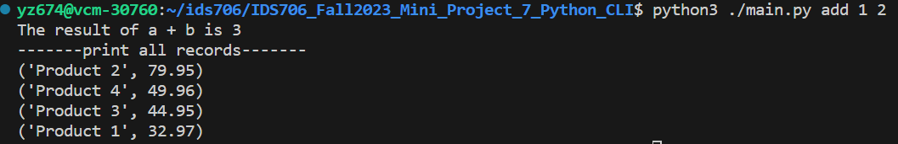

[](https://github.com/nogibjj/IDS706_Fall2023_Mini_Project_7_Python_CLI/actions/workflows/install.yml)
[](https://github.com/nogibjj/IDS706_Fall2023_Mini_Project_7_Python_CLI/actions/workflows/lint.yml)
[](https://github.com/nogibjj/IDS706_Fall2023_Mini_Project_7_Python_CLI/actions/workflows/format.yml)
[](https://github.com/nogibjj/IDS706_Fall2023_Mini_Project_7_Python_CLI/actions/workflows/test.yml)
# IDS706_Fall2023_Mini_Project_7_Python_CLI

IDS706 week 7 mini project: Package a Python script into a command-line tool and write a user guide.

It contains:

- ``.devcontainer`` includes a `Dockerfile` that specifies the configurations of container, and a `devcontainer.json` which is a configuration file used in the context of Visual Studio Code

- ``workflows`` includes `GitHub Actions`, enables automated build, test and deployment for the project

- ``Makefile`` specifies build automation on Linux

- ``requirements.txt`` lists the dependencies, libraries, and specific versions of Python packages required for the project

It also includes ``main.py`` and ``test_main.py`` as sample files to show the functionality of the CI pipeline.

## User Guide

The command line tool is packaged into `./yz674` folder. To install the package, first run 
```bash
make all
```
to install the whole project. Then run 
```bash
python3 setup.py sdist bdist_wheel
```
at the top level directory to generate the package. Then run 
```bash
pip install .
```
to install the package called `yz674`. The package is ready to use and can be imported to `main.py`, so you can run 
```bash
python3 ./main.py add [arg1] [arg2]
```
and it should print out the result of `arg1 + arg2` and also some result of SQLite database operations. For example, if you run
```bash
python3 ./main.py add 1 2
```
the result should be <br>

